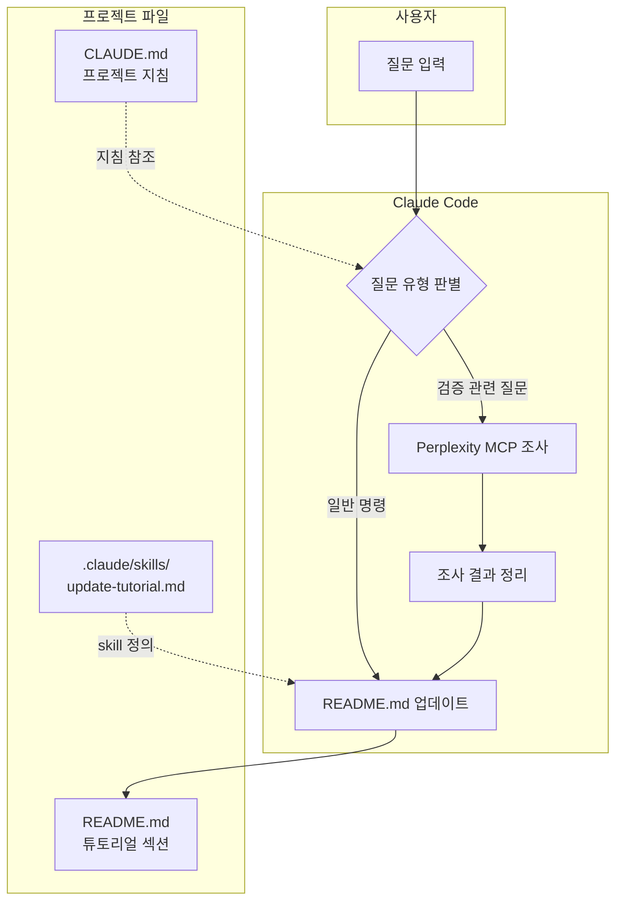
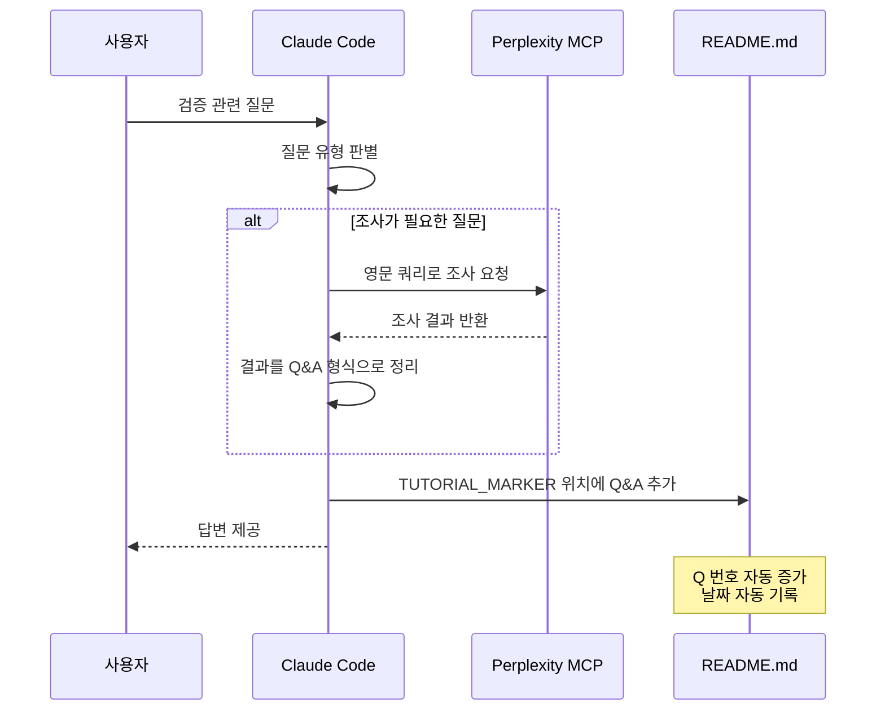

# Solar-Open-100B "From Scratch" 검증 프로젝트

## 프로젝트 개요

[upstage/Solar-Open-100B](https://huggingface.co/upstage/Solar-Open-100B) 모델이 실제로 "from scratch" (전체 가중치를 random initialization에서 시작하여 재학습)로 만들어졌는지 검증하는 프로젝트입니다.

이 프로젝트는 검증 과정에서 학습한 내용을 Q&A 튜토리얼 형태로 기록하여, LLM 모델의 학습 방식을 검증하는 방법론을 문서화합니다.

---

## Solar-Open-100B 공식 정보

| 항목 | 값 |
|------|-----|
| **모델 유형** | Mixture-of-Experts (MoE) |
| **총 파라미터** | 102.6B |
| **활성 파라미터** | 12B (토큰당) |
| **Expert 구성** | 129개 (128 routed + 1 shared, top-8 활성화) |
| **Context Length** | 128k tokens |
| **학습 토큰 수** | 19.7 trillion tokens |
| **학습 하드웨어** | NVIDIA B200 GPUs |
| **라이선스** | Solar-Apache License 2.0 |

**공식 주장**: "Trained Entirely from Scratch" (Hugging Face 모델 카드에 명시)

---

## 검증 방법론

LLM이 실제로 from scratch로 학습되었는지 확인하는 기술적 방법들:

### 1. Tokenizer 분석 (신뢰도: 높음)
- Vocabulary 비교: 기존 base model들과의 토큰 중복률 확인
- BPE merge rules 분석
- 특수 토큰(`<eos>`, `<pad>` 등) 패턴 비교

### 2. Weight 분석 (신뢰도: 높음)
- Layer별 cosine similarity 계산
- Weight tensor 해시 비교
- PCA를 통한 weight 분포 분석

### 3. Architecture 비교 (신뢰도: 중간)
- 레이어 수, hidden dimension, attention heads 비교
- 활성화 함수, normalization 방식 확인
- 고유한 구조적 특징 식별

### 4. 행동 분석 (신뢰도: 중간)
- Knowledge cutoff 테스트
- Refusal pattern 분석
- Safety alignment 특성 비교

### 5. Training Logs 검증 (신뢰도: 매우 높음, 접근성: 낮음)
- Loss curve 패턴 분석
- Compute 추정 (Chinchilla scaling 기준)

---

## 튜토리얼: Q&A 형식 학습 기록

아래는 검증 과정에서 진행한 질문과 답변을 시간순으로 기록합니다.

---

### Q1: LLM이 "from scratch"로 학습되었는지 어떻게 검증할 수 있나요?

**질문 시각**: 2026-01-04

**답변**:

LLM이 from scratch로 학습되었는지 vs fine-tuned인지 검증하는 여러 기술적 방법이 있습니다:

1. **Tokenizer 분석** (가장 접근성 높음)
   - Tokenizer는 재학습 비용이 높아 fine-tuning시 거의 재사용됨
   - Vocabulary의 95% 이상이 기존 모델과 동일하면 fine-tuning 가능성 높음
   - `tokenizer.get_vocab()`으로 추출하여 비교

2. **Weight 분석**
   - Fine-tuned 모델은 초기 레이어에서 base model과 90% 이상 cosine similarity 유지
   - SHA-256 해시로 weight tensor 비교
   - From scratch 모델은 PCA에서 orthogonal 분포

3. **Architecture 비교**
   - `model.config`로 hyperparameter 확인
   - 동일한 config는 fine-tuning 강력 증거
   - 고유한 구성요소(예: 특이한 RoPE scaling)는 from scratch 증거

4. **행동 테스트**
   - Knowledge cutoff 날짜 확인
   - Safety alignment, refusal pattern이 base model과 동일하면 fine-tuning 가능성

5. **Compute 추정**
   - From scratch는 fine-tuning 대비 10-100배 더 많은 compute 필요
   - 19.7T tokens 학습은 massive compute로, from scratch 주장과 일관성 있음

| 방법 | 신뢰도 | 접근성 | Fine-tuning 탐지력 |
|------|--------|--------|-------------------|
| Tokenizer 분석 | 높음 | 높음 | 우수 |
| Weight 해싱 | 높음 | 중간 | 양호 |
| Architecture 매칭 | 중간 | 높음 | 양호 |
| 행동 테스트 | 중간 | 높음 | 보통 |
| Training Logs | 매우 높음 | 낮음 | 우수 |

---

### Q2: Tokenizer 분석이란 무엇이고, 어떻게 from scratch 여부를 판별하나요?

**질문 시각**: 2026-01-04

**답변**:

#### Tokenizer의 작동 원리

Tokenizer는 텍스트를 모델이 처리할 수 있는 숫자(token ID)로 변환합니다. 주요 방식:

| 방식 | 특징 | 사용 모델 |
|------|------|----------|
| **BPE** (Byte Pair Encoding) | 빈도 기반으로 인접 문자쌍 병합 | GPT-2, RoBERTa |
| **WordPiece** | likelihood 최대화 기준 병합 | BERT |
| **SentencePiece** | 공백 포함 원시 텍스트 처리 (▁ 마커 사용) | T5, Gemma, Llama |

#### Fine-tuning 시 Tokenizer를 재학습하지 않는 이유

1. **Embedding 호환성**: 새 vocabulary는 pre-trained embedding과 호환되지 않음
2. **비용**: Tokenizer 재학습은 전체 corpus 재처리 필요
3. **성능 저하 위험**: Vocabulary 변경 시 원래 도메인 성능 저하

#### Vocabulary 중복률 기준

| 중복률 | 해석 |
|--------|------|
| **>98%** | Fine-tuning 가능성 높음 (safety token 등 소량 추가만) |
| **90-98%** | Continued pre-training 또는 vocabulary 확장 |
| **<90%** | From scratch 학습 강력 증거 |

#### 분석 기법

**1. Vocabulary 비교**
```python
from transformers import AutoTokenizer

base_tok = AutoTokenizer.from_pretrained("base-model")
target_tok = AutoTokenizer.from_pretrained("target-model")

base_vocab = set(base_tok.get_vocab().keys())
target_vocab = set(target_tok.get_vocab().keys())

overlap = len(base_vocab & target_vocab)
overlap_pct = (overlap / len(base_vocab)) * 100
print(f"중복률: {overlap_pct:.2f}%")
```

**2. Merge Rules 비교 (BPE/SentencePiece)**
```python
# merges가 동일하면 같은 tokenizer
base_merges = base_tok.backend_tokenizer.model.get_vocab()
target_merges = target_tok.backend_tokenizer.model.get_vocab()
```

**3. Special Tokens 비교**
```python
print(base_tok.special_tokens_map)
print(target_tok.special_tokens_map)
# [PAD], [UNK], [CLS], <eos> 등 비교
```

**4. Encoding 결과 비교**
```python
text = "Hello, world! 토큰화 테스트입니다."
base_tokens = base_tok.tokenize(text)
target_tokens = target_tok.tokenize(text)
# 동일 입력에 다른 토큰 분할 → 다른 tokenizer
```

#### Solar-Open-100B 검증 시 비교 대상

1. **Llama 계열**: Llama-2, Llama-3 (SentencePiece 기반)
2. **Mistral/Mixtral**: MoE 아키텍처 유사
3. **Qwen**: 대규모 한국어 포함 모델
4. **DeepSeek-MoE**: MoE 아키텍처

**핵심**: Solar-Open-100B의 tokenizer가 위 모델들과 90% 미만 중복이면 from scratch 주장 지지

---

<!-- TUTORIAL_MARKER: 새로운 Q&A는 이 마커 위에 자동 추가됩니다 -->

## 검증 진행 상황

- [ ] Tokenizer 분석
  - [ ] Solar-Open-100B tokenizer vocabulary 추출
  - [ ] Llama, Mistral, Qwen 등 주요 base model과 비교
  - [ ] 토큰 중복률 계산
- [ ] Architecture 분석
  - [ ] config.json 분석
  - [ ] 유사 MoE 모델들과 비교 (Mixtral, DeepSeek-MoE 등)
- [ ] Weight 분석 (선택적 - compute 리소스 필요)
  - [ ] Layer-wise similarity 분석
  - [ ] Embedding 비교
- [ ] 행동 분석
  - [ ] Knowledge cutoff 테스트
  - [ ] 특정 패턴 테스트

---

## 튜토리얼 자동 업데이트 시스템

이 프로젝트는 Claude Code의 hooks와 skills를 활용하여 Q&A 튜토리얼을 자동으로 업데이트합니다.

### 작동 방식



### 프로세스 상세



### 튜토리얼 업데이트 규칙

| 조건 | 동작 |
|------|------|
| 사용자 입력이 **질문**인 경우 | Perplexity MCP로 조사 → Q&A 형식으로 README에 추가 |
| 사용자 입력이 **명령**인 경우 | 명령 실행 (튜토리얼 업데이트 없음) |
| `/update-tutorial` 실행 | 현재 세션의 Q&A를 수동으로 README에 추가 |

### 자동 업데이트 대상 질문 유형

다음 주제에 대한 질문은 자동으로 튜토리얼에 기록됩니다:

1. **LLM 학습 검증 방법론** - from scratch vs fine-tuning 판별
2. **Tokenizer 분석** - vocabulary, BPE merge, special tokens
3. **Weight 분석** - cosine similarity, 해싱, PCA
4. **Architecture 분석** - config 비교, 구조적 특징
5. **MoE 모델 지식** - Mixture-of-Experts 아키텍처
6. **Solar-Open-100B 구체적 분석** - 실제 검증 결과

### 파일 구조

```
solar-open-100b-scratch-verification/
├── README.md                     # 메인 문서 + Q&A 튜토리얼
├── CLAUDE.md                     # Claude 프로젝트 지침
└── .claude/
    ├── settings.json             # Hooks 설정
    ├── commands/
    │   ├── commit-push.md        # /commit-push 커맨드
    │   └── save.md               # /save 커맨드 (빠른 저장)
    └── skills/
        └── update-tutorial.md    # /update-tutorial skill 정의
```

### 사용 가능한 Commands

| 커맨드 | 설명 | 사용법 |
|--------|------|--------|
| `/commit-push` | 변경사항 분석 후 커밋 & 푸시 | `/commit-push` |
| `/save` | 빠른 커밋 & 푸시 | `/save` 또는 `/save {메시지}` |
| `/update-tutorial` | Q&A 튜토리얼 수동 업데이트 | `/update-tutorial` |

### Q&A 형식

새로운 Q&A는 다음 형식으로 `<!-- TUTORIAL_MARKER -->` 위에 자동 추가됩니다:

```markdown
---

### Q{N}: {질문 제목}

**질문 시각**: {YYYY-MM-DD}

**답변**:

{Perplexity MCP 조사 기반 구조화된 답변}

---
```

---

## 참고 자료

- [Hugging Face - Solar-Open-100B](https://huggingface.co/upstage/Solar-Open-100B)
- [Model Integrity Verification](https://www.nightfall.ai/ai-security-101/model-integrity-verification)
- [LLM Evaluation Approaches](https://magazine.sebastianraschka.com/p/llm-evaluation-4-approaches)

---

## 라이선스

이 프로젝트의 문서와 코드는 MIT License로 공개됩니다.
